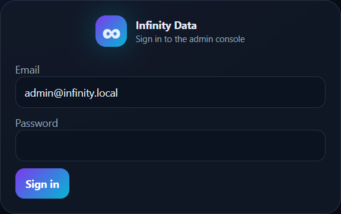
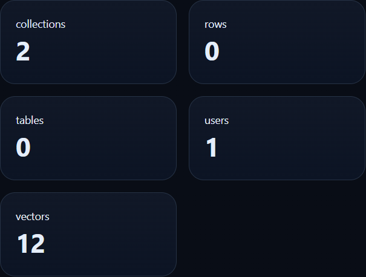
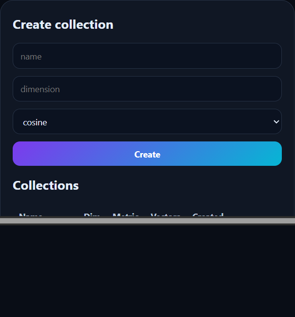
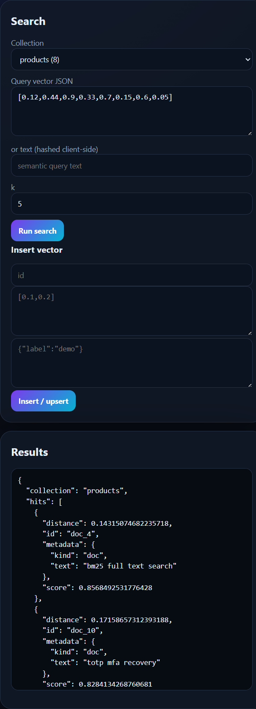

<div align="center">

# 🧠 Infinity Data

### Analytics + vector search, in one Rust binary.

**Vector collections (HNSW) · similarity search · tables · RBAC · admin dashboard**

A self-hostable alternative to **Snowflake, Databricks and Pinecone** — memory-safe, SQLite-simple, no per-credit billing.

[](https://www.rust-lang.org/)
[](../infinity-id/LICENSE)
[]()

</div>

---

## Why Infinity Data

Data warehouses lock you in and bill exponentially for compute; managed vector databases are memory-bound and expensive at scale. Infinity Data gives you **vector similarity search (HNSW)** and simple **tabular analytics** behind one authenticated Rust binary you can run on a laptop or a cloud box.

> Part of the [**Infinity Stack**](../README.md) — open-source, Rust-native replacements for over-monetized SaaS.

---

## 📸 Dashboard

An embedded dark-theme admin console — no separate frontend to deploy.

| Sign in | Overview |
|---|---|
|  |  |

| Collections | Vector Search |
|---|---|
|  |  |

---

## ✨ Features

- **Vector collections** — create collections with a fixed dimension + distance metric (cosine / L2)
- **HNSW index** — fast approximate nearest-neighbour search
- **Similarity search** — top-k search with scores + metadata
- **Tables** — simple tabular storage + query for analytics
- **API keys** — scoped keys for programmatic ingest/query (constant-time verified)
- **RBAC + audit** — role-guarded admin, immutable audit trail
- **Secure by design** — Argon2id, sessions, rate limiting, hardened headers
- **One binary** — SQLite-backed; `cargo run` and you're live

---

## 🔒 Security

| Area | Hardening |
|---|---|
| Passwords | Argon2id (memory-hard) |
| API keys | Stored hashed, **O(1) indexed lookup** with **constant-time** comparison |
| Sessions | `HttpOnly` + `SameSite=Strict` cookies (+ `Secure` by default off loopback), server-side revocation; 2-hour default TTL, expired sessions purged at startup |
| Access control | RBAC guard on admin + write paths; no unauthenticated data access |
| Privilege escalation | Callers may only assign roles / grant permissions they already hold; the built-in `superadmin` role is protected from non-superadmins |
| Account enumeration | Uniform login errors; disabled-account status checked only **after** password verification |
| Output encoding | Dashboard escapes all server-derived values before rendering (XSS) |
| Abuse | Per-account login lockout + global per-IP rate limiting; throttle state is memory-bounded |
| Transport | CSP, HSTS, `X-Frame-Options: DENY`, `nosniff`, `Referrer-Policy` |
| Errors | Generic client responses; internal errors logged server-side only |
| SQL | Parameterized queries throughout |

> **Dependency hardening (`cargo audit`):** `sqlx` was bumped `0.7` → `0.8`, fixing RUSTSEC-2026-0098, RUSTSEC-2026-0099, RUSTSEC-2026-0104, RUSTSEC-2024-0363, and RUSTSEC-2025-0134 (unmaintained `rustls-pemfile`), and clearing a yanked `spin` dependency warning. The unused `rsa` dependency (RUSTSEC-2023-0071, Marvin Attack timing side-channel) was removed entirely — it had zero usage sites anywhere in this codebase. `cargo audit` still lists RUSTSEC-2023-0071 in `Cargo.lock` because `sqlx`'s optional MySQL backend (unused here — this service is SQLite-only) pins a transitive `rsa` version that's never compiled into or reachable from this binary (confirmed via `cargo tree -i rsa`, which shows no reverse dependency in the built graph); this advisory is suppressed via `.cargo/audit.toml` with the reasoning documented there. `cargo audit` now passes clean.

---

## 🏗️ Architecture

```
infinity-data/
├─ crates/
│  ├─ data-core     # HNSW index, aggregation, model, config, security
│  ├─ data-server   # REST API + dashboard  → bin: infinity-data
│  └─ data-cli      # client / admin CLI     → bin: infinity-data-cli
└─ crates/data-server/migrations/   # SQLite schema
```

---

## 🚀 Quickstart

```bash
cd infinity-data
DATA_ADMIN_PASSWORD='ChooseAStrongOne#2026' cargo run --bin infinity-data
# open http://localhost:8094  (login: admin@infinity.local)
```

If you don't set `DATA_ADMIN_PASSWORD`, a strong password is generated and printed once. An initial API key is also printed once at first startup.

---

## 📚 API reference

| Method | Path | Description |
|---|---|---|
| `GET` | `/health` | Liveness probe |
| `GET` | `/api/stats` | Collection / vector / table counts |
| `GET`/`POST` | `/api/collections` | List / create vector collections |
| `GET`/`DELETE` | `/api/collections/:name` | Get / delete a collection |
| `POST` | `/api/collections/:name/vectors` | Upsert vectors |
| `POST` | `/api/collections/:name/search` | k-NN similarity search |
| `GET`/`POST` | `/api/tables` | List / create tables |
| `POST` | `/api/tables/:name/rows` | Insert rows |
| `POST` | `/api/tables/:name/query` | Query rows |
| `GET`/`POST`/`DELETE` | `/admin/api-keys` | Manage API keys |
| `GET` | `/admin/audit` | Audit log |

### Vector upsert + search (example)

```bash
# Create a collection (dim 8, cosine)
curl -X POST http://localhost:8094/api/collections \
  -H "Authorization: Bearer $API_KEY" -H "Content-Type: application/json" \
  -d '{"name":"products","dim":8,"metric":"cosine"}'

# Upsert vectors
curl -X POST http://localhost:8094/api/collections/products/vectors \
  -H "Authorization: Bearer $API_KEY" -H "Content-Type: application/json" \
  -d '{"points":[{"id":"p1","vector":[0.1,0.2,0.3,0.4,0.5,0.6,0.7,0.8],"metadata":{"text":"rust vector db"}}]}'

# Search
curl -X POST http://localhost:8094/api/collections/products/search \
  -H "Authorization: Bearer $API_KEY" -H "Content-Type: application/json" \
  -d '{"vector":[0.12,0.44,0.9,0.33,0.7,0.15,0.6,0.05],"k":5}'
```

---

## 🗺️ Roadmap

- [ ] SQL front-end + cost-based optimizer
- [ ] Object-storage (S3) columnar backend
- [ ] Disk-spilling HNSW for billion-scale
- [ ] Distributed coordination
- [ ] Auth & RBAC via **Infinity ID**

---

## License

[Apache-2.0](../infinity-id/LICENSE) © Infinity Stack.

> ⚠️ **Alpha software.** Change default credentials and serve over HTTPS before production use.
