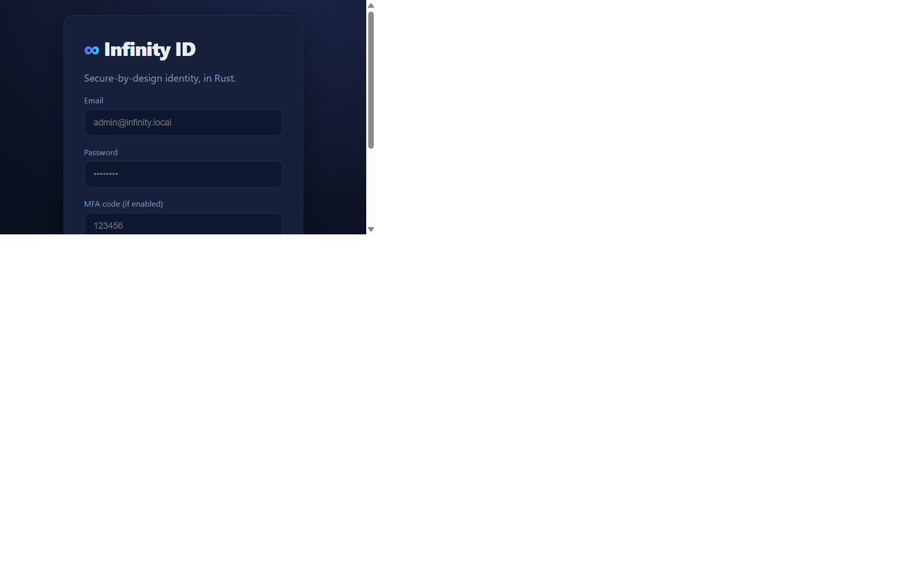
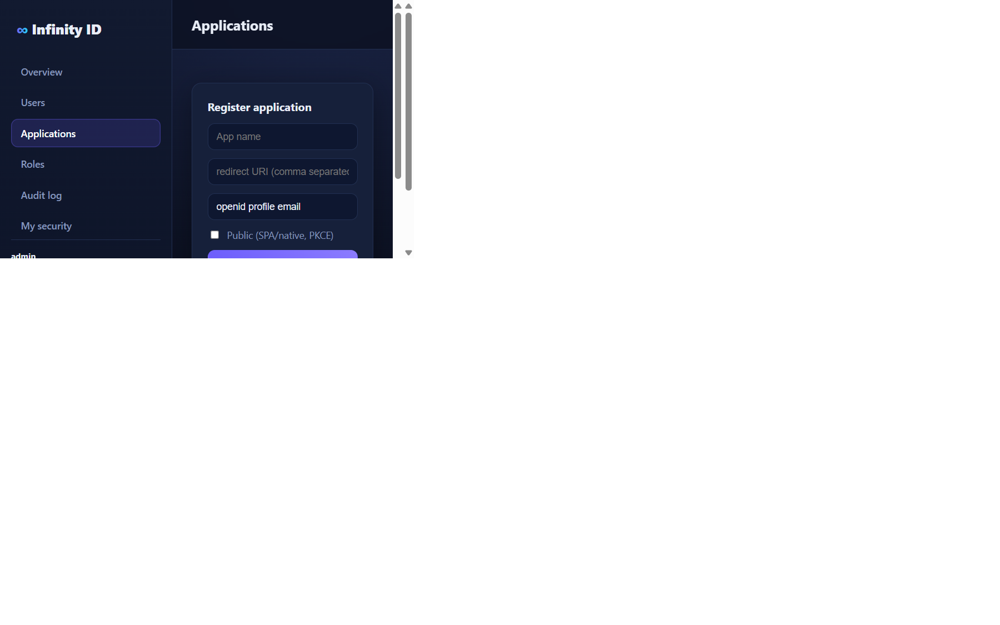
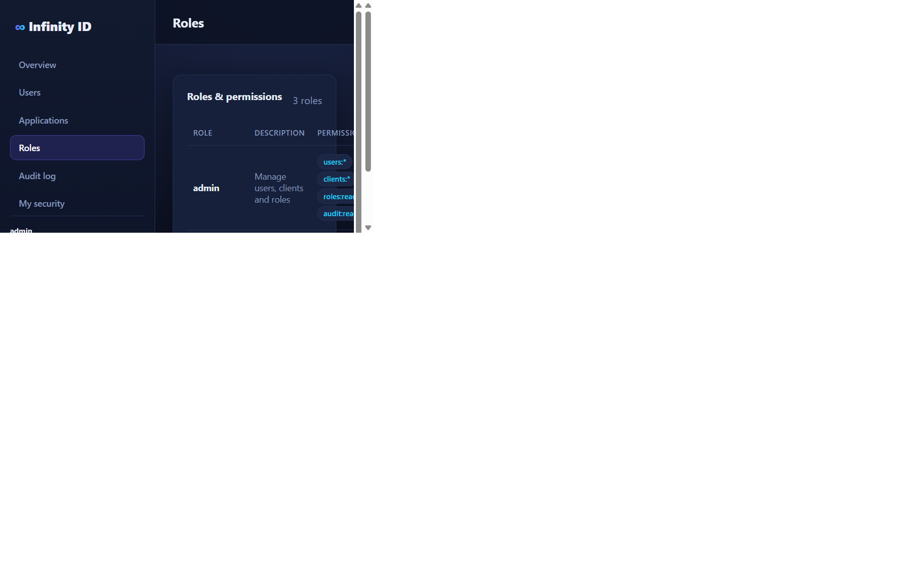
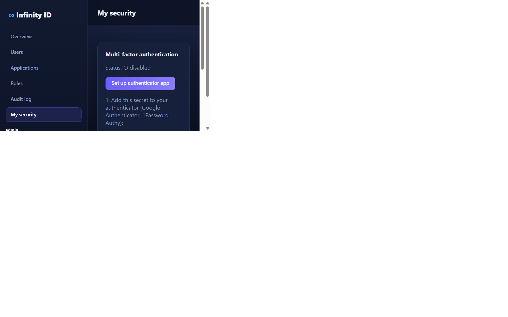

<div align="center">

# ∞ Infinity ID

### Secure-by-design identity & access management — in Rust.

**OpenID Connect · OAuth 2.0 · TOTP MFA · RBAC · Edge Gateway · Admin Dashboard**

A fast, single-binary, self-hostable alternative to **Auth0, Okta, OneLogin and Clerk** — without the "SSO tax," per-MAU billing, or feature gates on essential security.

[](https://www.rust-lang.org/)
[](./LICENSE)
[]()

</div>

---

## Why Infinity ID

Identity providers gate the security features you actually need — SAML, RBAC, impersonation, audit — behind expensive enterprise contracts, then bill you per monthly active user. Infinity ID takes the opposite stance:

- **Every security feature is in the box.** MFA, RBAC, refresh-token rotation, audit logging, rate limiting — no paywall.
- **One fast binary.** Written in Rust: no GC pauses, predictable tail latency, a tiny memory footprint, and memory safety by construction.
- **Runs anywhere.** SQLite by default — `cargo run` and you have a working IdP. Ships with Docker + Compose for cloud.
- **Secure by design.** Argon2id, RS256/JWKS, PKCE-enforced flows, and a hardened threat model (see [Security](#-security)).

> **Positioning:** Infinity ID is the flagship of the [**Infinity Stack**](../README.md) — a family of Rust-native replacements for over-monetized SaaS infrastructure.

---

## 📸 The dashboard

A modern, dark-theme admin console is **embedded in the binary** (no Node build, no separate frontend to deploy).

| Sign in | Overview |
|---|---|
|  |  |

| Users & roles | Applications (OAuth clients) |
|---|---|
|  |  |

| Roles & permissions | Audit log |
|---|---|
|  |  |

| Self-service MFA enrolment |
|---|
|  |

---

## ✨ Features

### Standards-based auth
- **OpenID Connect** discovery (`/.well-known/openid-configuration`) + **JWKS** (`/.well-known/jwks.json`)
- **OAuth 2.0 grants:** Authorization Code **+ PKCE (S256)**, Client Credentials, Refresh Token, and Resource-Owner Password (first-party CLI)
- **RS256** access & ID tokens signed with a persisted RSA key; validate anywhere with the public JWKS
- **`/userinfo`** endpoint

### Multi-factor authentication
- **TOTP (RFC 6238)** compatible with Google Authenticator, 1Password, Authy, etc.
- **Single-use recovery codes** (stored only as hashes)
- Self-service enrolment / activation / disable

### Access control
- **RBAC** with `resource:action` permissions and `*` wildcards (`users:*`, `*:*`)
- Built-in `superadmin` / `admin` / `user` roles, fully editable
- Privilege-escalation guards (an admin can't grant itself `superadmin`)

### Operations
- **Immutable audit log** of security events (logins, token issuance, admin changes)
- **Brute-force protection** (per-account lockout) + **global per-IP rate limiting**
- Structured tracing, CORS, and hardened HTTP security headers
- **Infinity Edge** — an auth-aware reverse proxy that validates tokens at the edge

---

## 🔒 Security

Infinity ID is built to withstand scrutiny from a security professional. Highlights:

| Area | Hardening |
|---|---|
| **Password storage** | Argon2id (memory-hard, OWASP params: 19 MiB, 2 passes) |
| **Token signing** | RS256 with persisted key; public JWKS; algorithm pinned on validation (no `alg=none`/HS confusion) |
| **PKCE** | Required for public clients; **only S256 accepted** (`plain` refused) |
| **Client auth** | Confidential clients authenticated at the token endpoint with **constant-time** secret comparison |
| **Auth codes** | Single-use, short-TTL, `redirect_uri` exact-match, bound to `client_id` |
| **Refresh tokens** | Rotated on use; **reuse detection revokes the whole token family** |
| **Scopes** | Requested scopes are **narrowed to the client's registration** — no self-asserted privileged scopes |
| **Token audience** | Management API requires a **first-party** token (audience = issuer) — third-party RP tokens can't be replayed against `/admin/*` |
| **Token type** | `id_token`s are rejected wherever an access token is expected (server **and** edge) |
| **Sessions** | Opaque, hashed at rest, `HttpOnly` + `SameSite=Strict` (+ `Secure` on HTTPS), **server-side revocation on logout** |
| **Brute force** | Per-account lockout + global per-IP rate limit (Argon2 makes floods expensive, so this matters) |
| **User enumeration** | Uniform errors + timing equalization for unknown accounts |
| **Transport hardening** | CSP, HSTS, `X-Frame-Options: DENY`, `X-Content-Type-Options: nosniff`, `Referrer-Policy`, `Permissions-Policy` |
| **Error handling** | Internal/DB errors are logged server-side and returned to clients as generic messages |
| **Edge** | Strips client-supplied identity headers; injects a verified `X-Infinity-Sub` |
| **First run** | If no admin password is provided, a strong random one is generated and shown once in the logs |

> This codebase passed an automated security review; all findings (scope self-assertion, audience confusion, role-escalation, edge token-type) were remediated and verified.

**TLS:** terminate HTTPS at Infinity Edge or a load balancer; set `issuer = https://…` so cookies become `Secure`.

---

## 🏗️ Architecture

A Cargo workspace of focused crates:

```
infinity-id/
├─ crates/
│  ├─ infinity-core     # security primitives: Argon2id, RSA/JWKS, JWT, TOTP, RBAC
│  ├─ infinity-server   # the IdP: OIDC/OAuth2, admin API, embedded dashboard  → bin: infinity-id
│  └─ infinity-edge     # auth-aware reverse proxy / API gateway               → bin: infinity-edge
├─ migrations/          # SQLite schema (embedded at compile time)
└─ Dockerfile, docker-compose.yml, Config.toml.example, Edge.toml.example
```

- **Storage:** SQLite via `sqlx` by default (zero-dependency, local). Postgres-friendly schema.
- **HTTP:** `axum` / `tower` / `hyper`.
- **Dashboard:** static SPA embedded with `rust-embed` — served by the same binary.

---

## 🚀 Quickstart

### Run locally (Rust)

```bash
cd infinity-id
# optional: cp Config.toml.example Config.toml   (or use env vars)
INFINITY_ADMIN_PASSWORD='ChooseAStrongOne#2025' cargo run --bin infinity-id
```

Open **http://localhost:8080** and sign in with `admin@infinity.local` and your password.
(If you don't set a password, one is generated and printed to the logs on first run.)

### Run with Docker

```bash
cd infinity-id
INFINITY_ADMIN_PASSWORD='ChooseAStrongOne#2025' docker compose up --build
# Infinity ID  → http://localhost:8080
# Infinity Edge → http://localhost:9000
```

### Verify

```bash
curl http://localhost:8080/health
curl http://localhost:8080/.well-known/openid-configuration
curl http://localhost:8080/.well-known/jwks.json
```

---

## ⚙️ Configuration

Layered: built-in defaults → `Config.toml` → `INFINITY_*` environment variables.

| Key / Env | Default | Description |
|---|---|---|
| `bind` / `INFINITY_BIND` | `0.0.0.0:8080` | Listen address |
| `issuer` / `INFINITY_ISSUER` | `http://localhost:8080` | Public issuer URL (use `https://` in prod) |
| `database_url` / `INFINITY_DATABASE_URL` | `sqlite://data/infinity.db` | DB connection string |
| `data_dir` / `INFINITY_DATA_DIR` | `data` | Signing key + DB directory |
| `access_token_ttl_secs` | `3600` | Access-token lifetime |
| `refresh_token_ttl_secs` | `2592000` | Refresh-token lifetime |
| `session_ttl_secs` | `28800` | Dashboard session lifetime |
| `admin_email` / `admin_password` | see notes | Seed admin (first run only) |
| `global_rate_limit_per_min` | `600` | Per-IP request cap / 60s (0 = off) |
| `mfa_issuer` | `Infinity ID` | Label in authenticator apps |
| `cors_origins` | `["http://localhost:8080"]` | Allowed browser origins |

See [`Config.toml.example`](./Config.toml.example) and [`.env.example`](./.env.example).

---

## 📚 API reference

### Discovery & keys
| Method | Path | Description |
|---|---|---|
| `GET` | `/.well-known/openid-configuration` | OIDC discovery document |
| `GET` | `/.well-known/jwks.json` | Public signing keys (JWKS) |
| `GET` | `/health` | Liveness probe |

### OAuth 2.0 / OIDC
| Method | Path | Description |
|---|---|---|
| `GET` | `/oauth/authorize` | Authorization Code + PKCE (requires dashboard session) |
| `POST` | `/oauth/token` | Token endpoint (all grants) |
| `GET` | `/userinfo` | OIDC userinfo (Bearer access token) |

### Dashboard session & self-service
| Method | Path | Description |
|---|---|---|
| `POST` | `/auth/login` · `/auth/logout` · `GET /auth/me` | Cookie session auth |
| `POST` | `/mfa/enroll` · `/mfa/activate` · `/mfa/disable` | TOTP MFA (first-party) |

### Admin API (RBAC-guarded, first-party token)
| Method | Path | Permission |
|---|---|---|
| `GET`/`POST` | `/admin/users` | `users:read` / `users:create` |
| `PATCH`/`DELETE` | `/admin/users/:id` | `users:update` / `users:delete` |
| `GET`/`POST` | `/admin/clients` | `clients:read` / `clients:create` |
| `DELETE` | `/admin/clients/:client_id` | `clients:delete` |
| `GET` | `/admin/roles` · `PUT /admin/roles` | `roles:read` / `roles:write` |
| `GET` | `/admin/audit` | `audit:read` |

### Example: get a token (password grant, first-party CLI)

```bash
curl -s -X POST http://localhost:8080/oauth/token \
  -d grant_type=password \
  -d username=admin@infinity.local \
  -d 'password=ChooseAStrongOne#2025' \
  -d scope='openid profile email'
```

```json
{ "access_token": "eyJ…", "id_token": "eyJ…", "refresh_token": "…",
  "token_type": "Bearer", "expires_in": 3600, "scope": "openid profile email" }
```

### Example: call a protected resource

```bash
curl http://localhost:8080/userinfo -H "Authorization: Bearer $ACCESS_TOKEN"
```

---

## 🛡️ Infinity Edge (API gateway)

A companion binary that fronts your services and enforces auth at the edge using Infinity ID's JWKS.

- Validates access tokens (RS256, `typ=access` only), enforces per-route scopes/roles
- Sliding per-IP rate limiting
- Injects a verified `X-Infinity-Sub` header for upstreams (and strips any spoofed one)

```bash
cp Edge.toml.example Edge.toml   # declare your routes/upstreams
cargo run --bin infinity-edge
```

```toml
[[routes]]
prefix = "/api"
upstream = "http://127.0.0.1:8081"
require_auth = true
required_scope = "api:access"
```

---

## 🆚 How it compares

| | **Infinity ID** | Auth0 / Okta | Clerk | Keycloak |
|---|---|---|---|---|
| Open source | ✅ Apache-2.0 | ❌ | ❌ | ✅ |
| Self-hosted single binary | ✅ | ❌ | ❌ | ⚠️ JVM |
| Per-MAU billing | ✅ none | ❌ | ❌ | ✅ none |
| MFA without upcharge | ✅ | ⚠️ tiered | ⚠️ tiered | ✅ |
| RBAC included | ✅ | ⚠️ tiered | ⚠️ | ✅ |
| Runtime footprint | 🟢 tiny (Rust) | n/a | n/a | 🔴 heavy (JVM) |
| Built-in edge gateway | ✅ | ❌ | ❌ | ❌ |

---

## 🗺️ Roadmap

- [ ] WebAuthn / passkeys
- [ ] SAML 2.0 IdP + upstream social/enterprise connections
- [ ] Postgres backend + signing-key rotation
- [ ] SCIM provisioning
- [ ] Distributed rate-limit / session store (Redis)
- [ ] Helm chart

---

## License

[Apache-2.0](./LICENSE) © Infinity Stack.

> ⚠️ **Alpha software.** Review, test, and pen-test before production use. Change the default admin credentials and serve over HTTPS.
