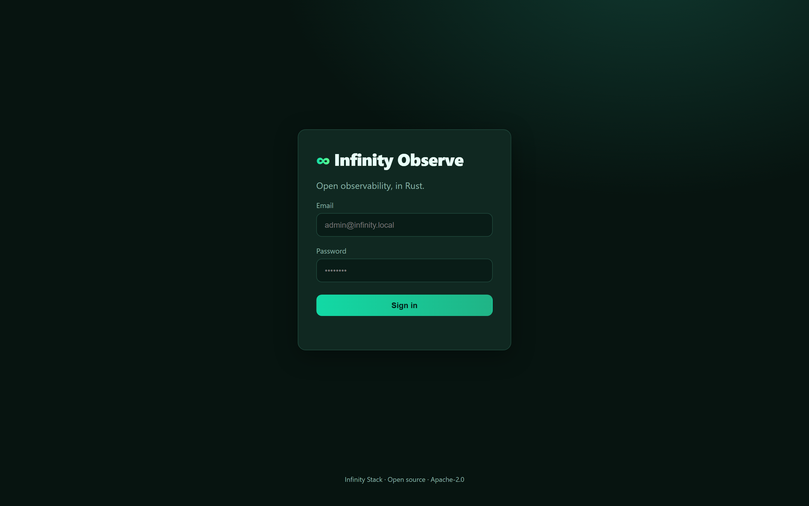
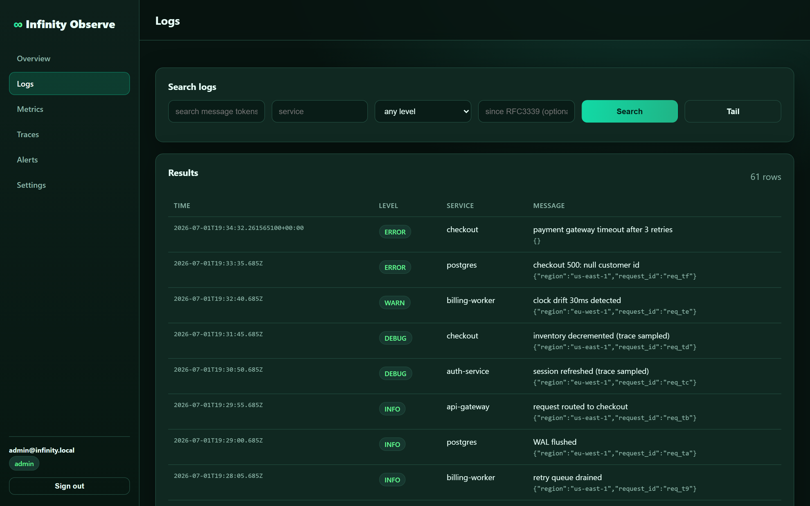
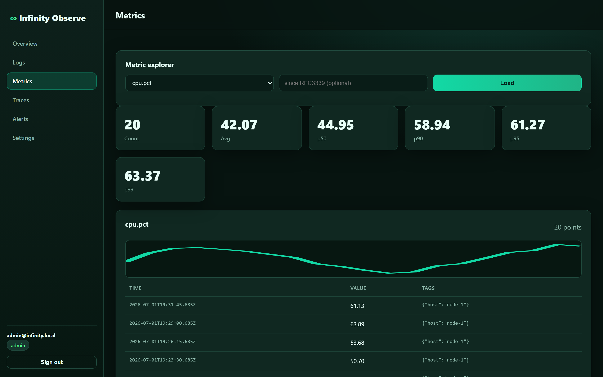
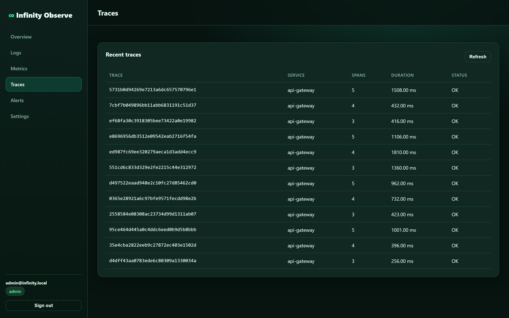
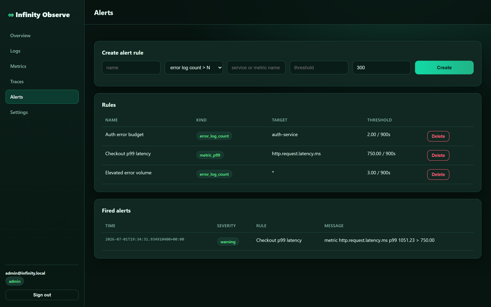

<div align="center">

# ∞ Infinity Observe

### Rust-native observability without the SaaS tax.

**Logs · Metrics · Traces · Alerts · Ingest API Keys · Embedded Admin Dashboard**

A fast, single-binary, self-hostable alternative to **Datadog, Splunk, New Relic and Sentry** — built for teams that want strong security controls, predictable cost and operational ownership.

[](https://www.rust-lang.org/)
[](./LICENSE)
[]()

</div>

---

## Why Infinity Observe

Observability vendors make telemetry expensive exactly when you need it most: during incidents, scale events and noisy releases. Infinity Observe takes the opposite stance:

- **One secure Rust binary.** API, storage and dashboard ship together with no Node build or sidecar frontend.
- **Write paths are locked down.** Logs, metrics and traces require a bearer ingest API key.
- **Operator-first economics.** Store telemetry in your infrastructure and scale on hardware, not event-based invoices.
- **Security controls are included.** Argon2id, server-side sessions, RBAC, rate limits, hardened headers and generic error responses are built in.

> **Positioning:** Infinity Observe is part of the [**Infinity Stack**](../README.md) — Rust-native replacements for over-monetized SaaS infrastructure.

---

## 📸 The dashboard

The dark-theme admin console is embedded in the binary and served from `/`.

| Sign in | Overview |
|---|---|
|  |  |

| Logs | Metrics |
|---|---|
|  |  |

| Traces | Alerts |
|---|---|
|  |  |

Dashboard routes/views:

| View | Route / nav |
|---|---|
| Login | `/` unauthenticated |
| Overview | `/` → `Overview` |
| Logs | `/` → `Logs` |
| Metrics | `/` → `Metrics` |
| Traces | `/` → `Traces` |
| Alerts | `/` → `Alerts` |
| Settings / ingest keys | `/` → `Settings` |

---

## ✨ Features

### Telemetry ingest
- JSON ingest endpoints for logs, metrics and traces.
- Bearer API key required for every write.
- Request body limits, per-batch limits and field validation.
- Ingest API keys are shown once and stored only as SHA-256 hashes.

### Query and operations
- Log search by service, level, time and message tokens.
- Metric names, time series and quantile summaries.
- Trace listing and per-trace span waterfalls.
- Alert rules for error-log volume and metric p99 thresholds.
- Embedded dashboard for operators and incident responders.

### Access control
- Admin dashboard authentication with opaque server-side sessions.
- `HttpOnly` + `SameSite=Strict` cookies; `Secure` is set by default and omitted only for loopback (`http://localhost` / `http://127.*`) development.
- RBAC guards on query, alert and key-management APIs.

---

## 🔒 Security

Infinity Observe is hardened by default:

| Area | Hardening |
|---|---|
| **Password storage** | Argon2id (memory-hard OWASP parameters: 19 MiB, 2 passes). |
| **First run** | If `OBSERVE_ADMIN_PASSWORD` is not set, a strong random admin password is generated and printed once in logs. |
| **Sessions** | Opaque random token, hashed at rest, server-side expiration/revocation, `HttpOnly`, `SameSite=Strict`, `Secure` by default (omitted only for loopback dev). |
| **RBAC** | Admin-only guards for alert mutation and ingest-key management; viewer role is read-only. |
| **Ingest auth** | Logs/metrics/traces require `Authorization: Bearer <ingest-key>`; active key hashes are compared in constant time. |
| **Brute force** | Per-account login lockout plus global per-IP fixed-window rate limiting. |
| **User enumeration** | Uniform login errors and dummy Argon2id verification for unknown users; disabled-account status is checked only after password verification. |
| **Transport hardening** | CSP, HSTS, `X-Frame-Options: DENY`, `X-Content-Type-Options: nosniff`, `Referrer-Policy`, `Permissions-Policy`. |
| **Error handling** | DB/internal errors are logged server-side and returned to clients as generic JSON. |
| **SQL safety** | All queries use `sqlx` bind parameters; dynamic log search appends only fixed SQL fragments. |
| **Request safety** | Configurable body limit, batch caps and string/JSON size validation. |
| **Secret hygiene** | `.gitignore` excludes `data/`, `target/`, databases, keys, logs and `.env` files. |
| **JWTs/JWKS** | Infinity Observe does not issue JWTs; ingest uses opaque API keys and the dashboard uses server-side sessions. |

**TLS:** terminate HTTPS at a load balancer or reverse proxy. Session cookies are marked `Secure` by default for any non-loopback `OBSERVE_PUBLIC_URL`, so browsers only send them over HTTPS.

---

## 🏗️ Architecture

```text
infinity-observe/
├─ crates/
│  ├─ observe-core     # domain models, t-digest/histogram, Argon2id, RBAC
│  ├─ observe-server   # ingest/query/alerts API + embedded dashboard → bin: infinity-observe
│  └─ observe-agent    # lightweight collector/forwarder scaffold
└─ docs/img/           # screenshot targets referenced by this README
```

- **Storage:** SQLite via `sqlx` by default.
- **HTTP:** `axum`, `tower-http`, `hyper`.
- **Dashboard:** static SPA embedded with `rust-embed`.
- **Security model:** separate ingest API keys for telemetry writes; session-cookie auth for dashboard/admin APIs.

---

## 🚀 Quickstart

### Run locally (Rust)

```powershell
Set-Location C:\Users\bchmi\infinity-stack\infinity-observe
$env:OBSERVE_ADMIN_PASSWORD = 'ChooseAStrongOne#2026'
cargo run --bin infinity-observe
```

Open **http://localhost:8090** and sign in with:

- **Email:** `admin@infinity.local`
- **Password:** the value of `OBSERVE_ADMIN_PASSWORD`

If you do not set `OBSERVE_ADMIN_PASSWORD`, the server generates a random admin password and prints it once in the startup logs.

### Verify

```powershell
Invoke-RestMethod http://localhost:8090/health
```

Create or copy an ingest key from **Settings → Create ingest API key**, then ingest:

```powershell
$env:OBSERVE_INGEST_KEY = 'io_...'
Invoke-RestMethod `
  -Method Post `
  -Uri http://localhost:8090/v1/logs `
  -Headers @{ Authorization = "Bearer $env:OBSERVE_INGEST_KEY" } `
  -ContentType 'application/json' `
  -Body '[{"level":"INFO","service":"demo","message":"hello from Infinity Observe"}]'
```

---

## ⚙️ Configuration

Layered: built-in defaults → `Config.toml` → `OBSERVE_*` environment variables.

| Key / Env | Default | Description |
|---|---|---|
| `bind` / `OBSERVE_BIND` | `0.0.0.0:8090` | Listen address. |
| `public_url` / `OBSERVE_PUBLIC_URL` | `http://localhost:8090` | External URL; `https://` enables `Secure` cookies. |
| `database_url` / `OBSERVE_DATABASE_URL` | `sqlite://data/observe.db` | SQLite connection string. |
| `data_dir` / `OBSERVE_DATA_DIR` | `data` | Directory for local DB/data files. |
| `session_ttl_secs` / `OBSERVE_SESSION_TTL_SECS` | `28800` | Dashboard session lifetime. |
| `global_rate_limit_per_min` / `OBSERVE_GLOBAL_RATE_LIMIT_PER_MIN` | `600` | Per-IP request cap per minute (`0` disables). |
| `max_request_body_bytes` / `OBSERVE_MAX_REQUEST_BODY_BYTES` | `1048576` | Maximum JSON body size. |
| `admin_email` / `OBSERVE_ADMIN_EMAIL` | `admin@infinity.local` | Seed admin email on first run. |
| `admin_password` / `OBSERVE_ADMIN_PASSWORD` | generated if unset | Seed admin password on first run. |
| `cors_origins` / `OBSERVE_CORS_ORIGINS` | localhost origins | Allowed browser origins. |

---

## API reference

### Public

| Method | Path | Auth | Description |
|---|---|---|---|
| `GET` | `/health` | none | Liveness probe. |
| `GET` | `/` | session | Embedded dashboard SPA. |

### Dashboard/session

| Method | Path | Auth | Description |
|---|---|---|---|
| `POST` | `/auth/login` | none | Login with `{ "email", "password" }`; sets session cookie. |
| `POST` | `/auth/logout` | session | Revoke current session. |
| `GET` | `/auth/me` | session | Current principal and permissions. |

### Ingest

All ingest endpoints require `Authorization: Bearer <ingest-key>`.

| Method | Path | Body |
|---|---|---|
| `POST` | `/v1/logs` | array of `{ timestamp?, level, service, message, attributes? }` |
| `POST` | `/v1/metrics` | array of `{ timestamp?, name, value, tags? }` |
| `POST` | `/v1/traces` | array of spans with `trace_id`, `span_id`, `name`, `service`, `start`, `end` or `duration_ms` |

### Query/admin

All query/admin endpoints require the dashboard session cookie.

| Method | Path | Permission |
|---|---|---|
| `GET` | `/v1/stats` | `stats:read` |
| `GET` | `/v1/logs` | `logs:read` |
| `GET` | `/v1/metrics/names` | `metrics:read` |
| `GET` | `/v1/metrics/series?name=...` | `metrics:read` |
| `GET` | `/v1/metrics/summary?name=...` | `metrics:read` |
| `GET` | `/v1/traces` | `traces:read` |
| `GET` | `/v1/traces/:trace_id` | `traces:read` |
| `GET` | `/v1/alerts` | `alerts:read` |
| `GET` | `/v1/alerts/rules` | `alerts:read` |
| `POST` | `/v1/alerts/rules` | `alerts:create` |
| `DELETE` | `/v1/alerts/rules/:id` | `alerts:delete` |
| `GET` | `/v1/keys` | `keys:read` |
| `POST` | `/v1/keys` | `keys:create` |
| `DELETE` | `/v1/keys/:id` | `keys:delete` |

---

## 🗺️ Roadmap

- [ ] OTLP/HTTP and OTLP/gRPC compatibility.
- [ ] Parquet/object-storage backend for cold telemetry.
- [ ] DataFusion/Arrow query acceleration.
- [ ] Dashboard-builder and saved views.
- [ ] Distributed rate limiting for multi-node deployments.
- [ ] Native Infinity ID SSO integration.

---

## License

Licensed under **Apache-2.0**.
