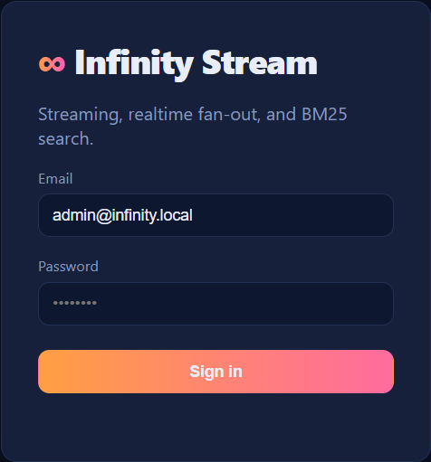
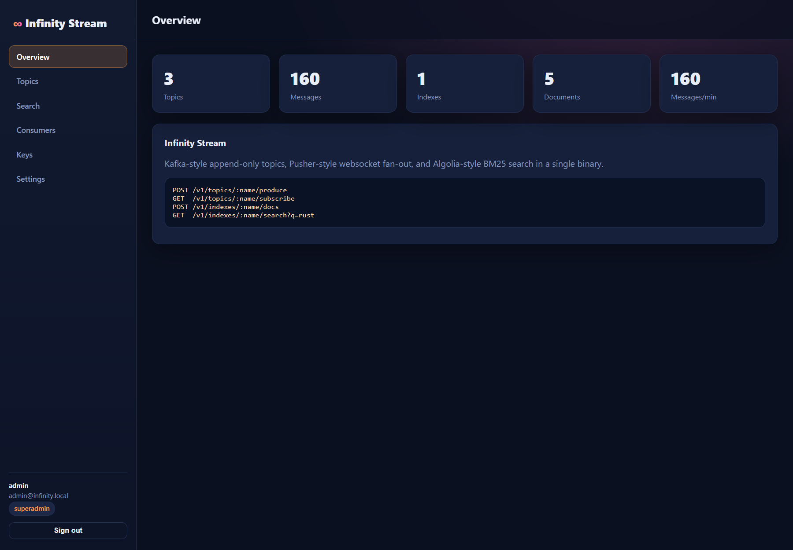
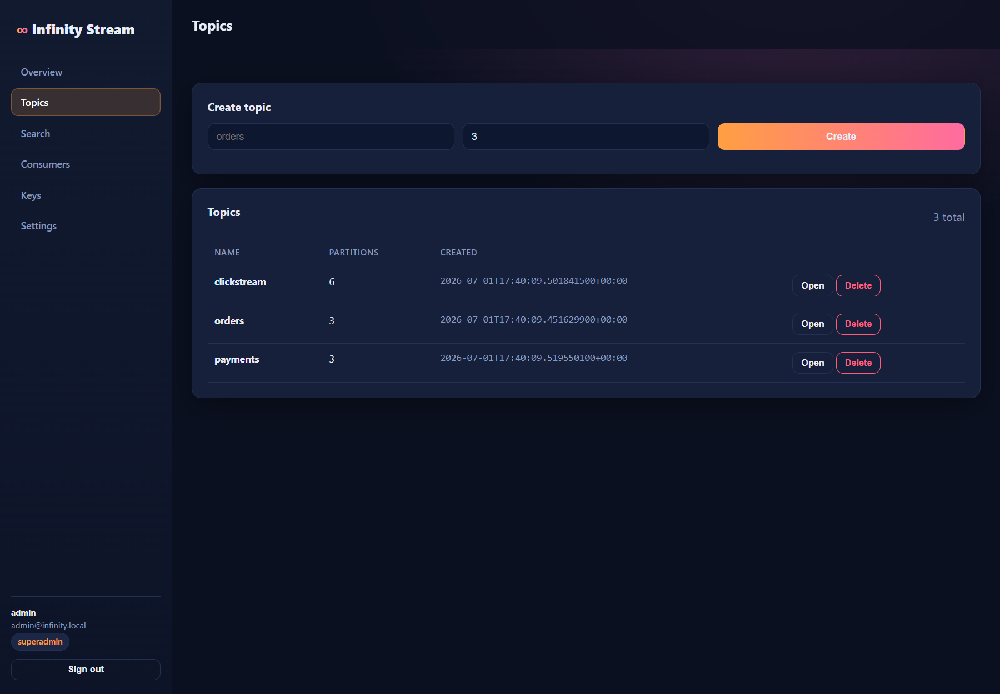
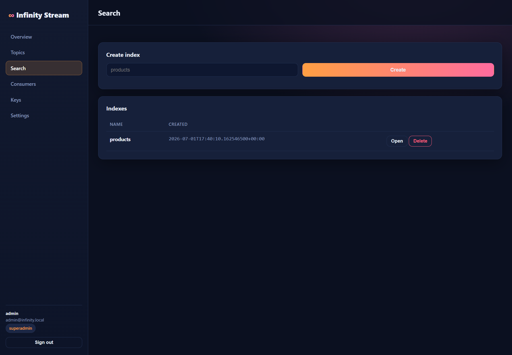

<div align="center">

# ⚡ Infinity Stream

### Real-time streaming + search, in one Rust binary.

**Append-only commit log · BM25 full-text search · WebSocket pub/sub · Admin dashboard**

A fast, self-hostable alternative to **Kafka/Confluent, Elasticsearch, Algolia and Pusher** — without the JVM overhead, the ops burden, or usage-spike billing.

[](https://www.rust-lang.org/)
[](../infinity-id/LICENSE)
[]()

</div>

---

## Why Infinity Stream

Event streaming and search are two of the most expensive, operationally-heavy layers of the stack. Kafka needs a JVM, ZooKeeper/KRaft, and a dedicated ops team. Elasticsearch is famously RAM-hungry. Algolia and Pusher bill aggressively on usage spikes. Infinity Stream folds **durable topics, full-text search, and realtime fan-out** into a single Rust binary you can run anywhere.

> Part of the [**Infinity Stack**](../README.md) — open-source, Rust-native replacements for over-monetized SaaS.

---

## 📸 Dashboard

A modern dark-theme console is embedded in the binary — no separate frontend to deploy.

| Sign in | Overview |
|---|---|
|  |  |

| Topics | BM25 Search |
|---|---|
|  |  |

---

## ✨ Features

- **Durable topics** — append-only commit log with partitions, offsets and consumer groups
- **BM25 search** — built-in inverted index (an Elasticsearch/Algolia-style search engine)
- **Realtime pub/sub** — WebSocket subscribe for presence / live fan-out
- **Producer/consumer API** — simple HTTP `produce` / `consume` / `commit`
- **API keys** — scoped keys for producers & consumers (constant-time verified)
- **RBAC + audit** — role-guarded admin, immutable audit trail
- **Secure by design** — Argon2id, session cookies, rate limiting, hardened headers
- **One binary** — SQLite-backed, `cargo run` and you're live

---

## 🔒 Security

| Area | Hardening |
|---|---|
| Passwords | Argon2id (memory-hard) |
| API keys | Stored hashed, **O(1) indexed lookup** with **constant-time** comparison; **least-privilege data-plane scope** (produce/consume/search/create) — a leaked key cannot delete topics/indexes, and key-management routes **explicitly reject API keys** even if scopes are ever widened |
| Sessions | `HttpOnly` + `SameSite=Strict` cookies (+ `Secure` by default off loopback), server-side revocation; 2-hour default TTL, expired sessions purged at startup |
| Access control | RBAC guard on admin + write paths; no unauthenticated produce |
| Path safety | Topic / index / group names are validated at the API **and** re-checked at the commit-log filesystem sink — no path traversal |
| Abuse | Per-account login lockout + global per-IP rate limiting; throttle state is memory-bounded |
| Transport | CSP, HSTS, `X-Frame-Options: DENY`, `nosniff`, `Referrer-Policy` |
| Errors | Generic client responses; internal errors logged server-side only |
| SQL | Parameterized queries throughout |
| Dependencies | `sqlx` upgraded 0.7 → 0.8.6, resolving RUSTSEC-2026-0098/0099/0104, RUSTSEC-2024-0363 and RUSTSEC-2025-0134 (vulnerable `rustls-webpki`, unmaintained `rustls-pemfile`, yanked `spin`) with **zero feature-flag changes**; the orphaned `rsa` workspace dependency (dead code, pulled in by nothing) was **removed entirely**, closing our direct exposure to RUSTSEC-2023-0071 (Marvin Attack timing side-channel). `cargo audit` still lists RUSTSEC-2023-0071 in `Cargo.lock` purely because `sqlx`'s optional MySQL backend (unused — this service is SQLite-only) pins a transitive `rsa` version that's never compiled into or reachable from this binary (confirmed via `cargo tree -i rsa`); suppressed via `.cargo/audit.toml` with the reasoning documented there. `cargo audit` now passes clean |

---

## 🏗️ Architecture

```
infinity-stream/
├─ crates/
│  ├─ stream-core     # commit log + BM25 index primitives, config, security
│  ├─ stream-server   # broker + search + WebSocket API + dashboard  → bin: infinity-stream
│  └─ stream-cli      # producer/consumer/admin CLI
└─ migrations/        # SQLite schema
```

---

## 🆚 How it compares

| | **Infinity Stream** | Kafka / Confluent | Elasticsearch | Algolia / Pusher |
|---|---|---|---|---|
| Open source | ✅ Apache-2.0 | ⚠️ partial | ⚠️ partial | ❌ |
| Self-hosted single binary | ✅ | ❌ needs JVM + ZooKeeper/KRaft | ❌ JVM, RAM-hungry | ❌ |
| Usage-spike billing | ✅ none | ⚠️ Confluent Cloud tiers | ⚠️ managed tiers | ❌ |
| Durable topics + full-text search in one binary | ✅ | ❌ search not included | ⚠️ search only | ❌ streaming not included |
| Realtime pub/sub (WebSocket) | ✅ | ⚠️ via Kafka Streams/Connect | ❌ | ✅ |
| RBAC + scoped API keys | ✅ | ⚠️ tiered (ACLs, no built-in RBAC UI) | ⚠️ tiered | ⚠️ tiered |
| Runtime footprint | 🟢 tiny (Rust) | 🔴 heavy (JVM) | 🔴 heavy (JVM) | n/a managed only |

---

## 🚀 Quickstart

```bash
cd infinity-stream
STREAM_ADMIN_PASSWORD='ChooseAStrongOne#2026' cargo run --bin infinity-stream
# open http://localhost:8092  (login: admin@infinity.local)
```

If you don't set `STREAM_ADMIN_PASSWORD`, a strong password is generated and printed once. An initial API key is also printed once at first startup.

---

## 📚 API reference

| Method | Path | Description |
|---|---|---|
| `GET` | `/health` | Liveness probe |
| `GET`/`POST` | `/v1/topics` | List / create topics |
| `POST` | `/v1/topics/:name/produce` | Produce records |
| `GET` | `/v1/topics/:name/consume` | Consume from an offset |
| `POST` | `/v1/topics/:name/commit` | Commit a consumer-group offset |
| `GET` | `/v1/topics/:name/subscribe` | WebSocket live subscribe |
| `GET`/`POST` | `/v1/indexes` | List / create search indexes |
| `POST` | `/v1/indexes/:name/docs` | Upsert documents |
| `GET` | `/v1/indexes/:name/search?q=…&k=…` | BM25 search |
| `GET`/`POST` | `/v1/keys` | List / create API keys |

### Produce + search (example)

```bash
# Produce
curl -X POST http://localhost:8092/v1/topics/orders/produce \
  -H "Authorization: Bearer $API_KEY" -H "Content-Type: application/json" \
  -d '{"records":[{"key":"o-1","value":{"amount":42.00,"status":"paid"}}]}'

# Index + search
curl -X POST http://localhost:8092/v1/indexes/products/docs \
  -H "Authorization: Bearer $API_KEY" -H "Content-Type: application/json" \
  -d '{"docs":[{"id":"p1","text":"rust powered streaming and search"}]}'

curl "http://localhost:8092/v1/indexes/products/search?q=rust&k=5" \
  -H "Authorization: Bearer $API_KEY"
```

---

## 🗺️ Roadmap

- [ ] Kafka wire-protocol compatibility layer
- [ ] Segment compaction + retention policies
- [ ] Distributed replication
- [ ] Phrase / fuzzy search operators
- [ ] Auth & ACLs via **Infinity ID**

---

## License

[Apache-2.0](../infinity-id/LICENSE) © Infinity Stack.

> ⚠️ **Alpha software.** Change default credentials and serve over HTTPS before production use.
